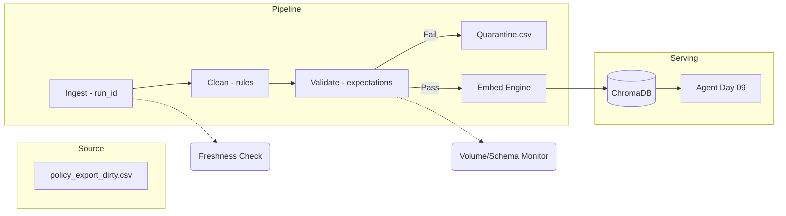

# Kiến trúc pipeline — Lab Day 10

**Nhóm:** 36
**Cập nhật:** 15/04/2026

---

## 1. Sơ đồ luồng (bắt buộc có 1 diagram: Mermaid / ASCII)

---

## 2. Ranh giới trách nhiệm

| Thành phần | Input | Output | Owner nhóm |
|------------|-------|--------|--------------|
| Ingest | Raw CSV | Raw records + Run ID | Ingestion Owner |
| Transform | Raw records | Cleaned records | Cleaning Owner |
| Quality | Cleaned records | Pass/Fail status | Quality Owner |
| Embed | Validated data | Vector Index | Embed Owner |
| Monitor| Manifest / Log | Freshness/SLA Alert | Monitoring Owner |

---

## 3. Idempotency & rerun

Hệ thống sử dụng chiến lược **Upsert theo stable chunk_id**. `chunk_id` được tạo ra bằng cách gộp `doc_id` và `seq` (hoặc hash nội dung). 
**Kết quả:** Khi rerun pipeline 2 lần với cùng một dữ liệu, ChromaDB sẽ tự động ghi đè lên các bản ghi cũ dựa trên ID, đảm bảo không bị phình to (duplicate) vector store. Ngoài ra, pipeline có bước `prune` để xóa bỏ các ID cũ không còn tồn tại trong bản nạp mới.

---

## 4. Liên hệ Day 09

Pipeline này cung cấp corpus tri thức sạch cho các Worker của Day 09. Thay vì Agent đọc trực tiếp từ tệp thô, nó sẽ truy vấn qua collection `day10_kb` đã được chuẩn hóa. Điều này giúp Supervisor của Day 09 đưa ra quyết định dựa trên chính sách mới nhất (v4) thay vì các bản draft cũ.

---

## 5. Rủi ro đã biết

- **Language Mix:** Chưa lọc được các văn bản đa ngôn ngữ phát sinh từ lỗi OCR.
- **Timestamp Drift:** Do dữ liệu mẫu cũ nên Freshness Check luôn báo FAIL (cần cập nhật exported_at).
